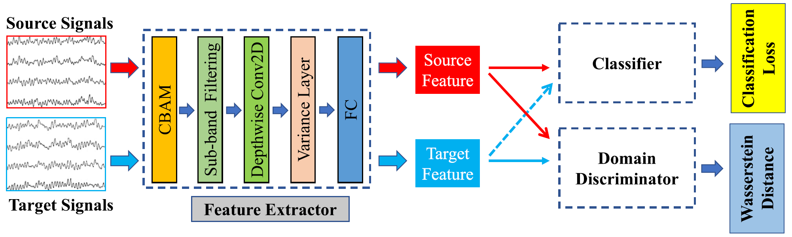

# Improved Domain Adaptation Network Based on Wasserstein Distance for Motor Imagery EEG Classification

**IEEE Transactions on Neural Systems and Rehabilitation Engineering, Vol. 31, 2023**  
[📄 Paper Link](https://ieeexplore.ieee.org/document/10035017)

This repository implements a domain adaptation classifier for EEG-based Brain-Computer Interface (BCI) systems.  
The model integrates Wasserstein GAN (WGAN) and adversarial training to improve classification performance in motor imagery (MI) tasks, particularly in cross-subject scenarios.

---

## Overview



This project is based on a deep learning architecture that tackles the challenges of EEG classification, such as low SNR and non-stationarity, by applying a domain adaptation framework using Wasserstein Distance. The model extracts domain-invariant features from source and target EEG signals, enabling robust cross-subject MI classification.
Source/target features are processed jointly via a feature extractor and then passed through both a domain discriminator and classifier.
Wasserstein-based adversarial training helps align feature distributions across domains without requiring labels from the target domain.
The system is evaluated on the BCI Competition IV 2a dataset.


##  Project Structure

```
├── Datasets/           # Contains BCI Competition IV 2a dataset
├── models/             # Model definitions
│   ├── generator.py        # Feature extractor + classifier
│   └── discriminator.py    # Domain discriminator (WGAN)
├── utils/              # Utility functions (filtering, logging, etc.)
├── results/            # Experiment results and logs
├── main.py             # Main training script
├── requirements.txt    # Python dependencies
└── README.md           # Project documentation
```

## Features

- Domain adaptation using Wasserstein GAN
- 4-class motor imagery classification
- Leave-One-Subject-Out cross-validation
- Per-subject logs and auto result saving

## Installation

1. **Clone the Repository**
    ```bash
    git clone https://github.com/HurDuhwan/2025-1_BCI_Project.git
    cd 2025-1_BCI_Project
    ```

2. **(Optional) Pull Docker Image**
    ```bash
    docker pull pytorch/pytorch:1.13.1-cuda11.6-cudnn8-devel
    ```

3. **(Optional) Run Docker Container**
    ```bash
    docker run -it --rm --gpus all \
      -v "$(pwd)":/workspace -w /workspace \
      pytorch/pytorch:1.13.1-cuda11.6-cudnn8-devel /bin/bash
    ```

4. **Install Python Requirements**
    ```bash
    pip install -r requirements.txt
    ```

---

## 📁 Dataset & Preprocessing

- **Dataset**: BCI Competition IV Dataset 2a (9 subjects, 4 motor imagery classes: left hand, right hand, feet, tongue)
- **Sampling rate**: 250 Hz  
- **Channels used**: 22 EEG channels (EOG channels excluded)  
- **Preprocessing pipeline**:
  - Band-pass filtering (8–32 Hz) using a 4th-order Butterworth filter

> Download the official dataset from the [BCI Competition IV website](http://www.bbci.de/competition/iv/) and place it under the `Datasets/` directory.

After preprocessing, each subject’s data is stored in its own folder. Each folder contains:

- `training.mat`: source domain data used for training  
- `evaluation.mat`: target domain data used for evaluation

The directory structure should look like this:

```
datasets/
├── A01T.mat
├── A01E.mat
├── A02T.mat
├── A02E.mat
...
└── A09E.mat
```

> ⚠️ **Note**: This repository does **not** include scripts to convert raw `.gdf` or `.edf` files.  
> You must manually preprocess the raw EEG data using tools such as **MNE-Python** or **MATLAB**, including filtering, epoching, and normalization.

---

## Train

To train the model, run:
```bash
CUDA_VISIBLE_DEVICES=0 python main.py
```
- You can specify the GPU number by changing the value after `CUDA_VISIBLE_DEVICES=`.
- Hyperparameters can be modified directly in `main.py` or in the relevant config files.

---

## Evaluation

- Training and evaluation logs will be saved in the `results/` directory.
- The best and average accuracy for each subject will be recorded in `results/sub_result.txt`.
- You can review per-subject logs in `results/log_subject{n}.txt`.

---

## Citation

If you use this code or find it helpful, please cite the original paper:

> **Improved Domain Adaptation Network Based on Wasserstein Distance for Motor Imagery EEG Classification**  
> [Add full citation here]

---

## License

This project is licensed under the MIT License. See the [LICENSE](./LICENSE) file for details.

---

## Contact

For questions or collaborations, please open an issue or contact [HurDuhwan](https://github.com/HurDuhwan). 
