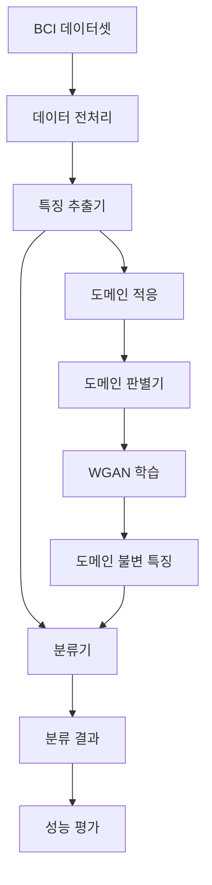

# BCI 프로젝트: WGAN-MI 분류기

이 프로젝트는 뇌-컴퓨터 인터페이스(BCI) 데이터를 위한 도메인 적응 분류기를 구현한 것입니다. WGAN(Wasserstein GAN)과 도메인 적응을 결합하여 모터 이미지(Motor Imagery) 분류를 수행합니다.

## 프로젝트 흐름도



## 프로젝트 구조

```
.
├── Datasets/          # BCI 데이터셋 저장 디렉토리
├── models/           # 모델 아키텍처 정의
│   ├── generator.py  # 특징 추출기와 분류기
│   └── discriminator.py  # 도메인 판별기
├── results/          # 실험 결과 저장
├── utils/           # 유틸리티 함수
├── main.py          # 메인 실행 파일
├── requirements.txt  # 의존성 패키지 목록
└── README.md        # 프로젝트 문서
```

## 주요 기능

- WGAN 기반 도메인 적응 학습
- 모터 이미지 분류 (4개 클래스)
- 교차 검증을 통한 성능 평가
- 자동화된 실험 결과 기록

## 설치 방법

1. 저장소 클론:
```bash
git clone https://github.com/[your-username]/bci-wgan-mi.git
cd bci-wgan-mi
```

2. 필요한 패키지 설치:
```bash
pip install -r requirements.txt
```

3. 데이터셋 준비:
- BCI Competition IV Dataset 2a를 `Datasets/` 디렉토리에 위치시킵니다.

## 사용 방법

1. 모델 학습 및 평가:
```bash
python main.py
```

2. 결과 확인:
- 실험 결과는 `results/` 디렉토리에 저장됩니다.
- 각 피험자별 결과는 `results/log_subject{번호}.txt`에 기록됩니다.
- 전체 결과 요약은 `results/sub_result.txt`에서 확인할 수 있습니다.

## 모델 아키텍처

### 특징 추출기 (Feature Extractor)
- CNN 기반 특징 추출
- 입력: 22채널 EEG 데이터
- 출력: 64차원 특징 벡터

### 분류기 (Classifier)
- 추출된 특징을 기반으로 클래스 분류
- 4개 클래스 분류 (모터 이미지)
- Softmax 활성화 함수 사용

### 도메인 판별기 (Domain Discriminator)
- 소스와 타겟 도메인 구분
- Wasserstein 거리 기반 학습
- 그래디언트 패널티 적용

## 하이퍼파라미터

- 배치 크기: 32
- 에포크 수: 200
- 학습률: 0.0005
- 특징 차원: 64
- 입력 채널: 22
- Adam 옵티마이저 (β1=0.5, β2=0.999)

## 요구사항

- Python 3.6+
- PyTorch >= 1.7.0
- NumPy >= 1.19.2
- SciPy >= 1.6.0
- 기타 requirements.txt에 명시된 패키지들

## 라이선스

이 프로젝트는 MIT 라이선스 하에 배포됩니다. 자세한 내용은 LICENSE 파일을 참조하세요.

## 기여 방법

1. 이 저장소를 포크합니다.
2. 새로운 브랜치를 생성합니다 (`git checkout -b feature/amazing-feature`).
3. 변경사항을 커밋합니다 (`git commit -m 'Add some amazing feature'`).
4. 브랜치에 푸시합니다 (`git push origin feature/amazing-feature`).
5. Pull Request를 생성합니다. 